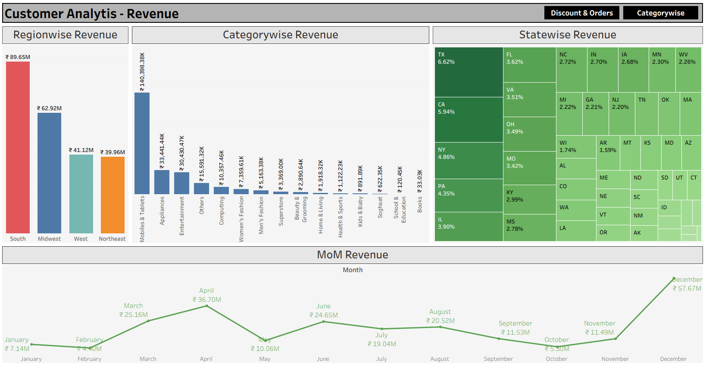
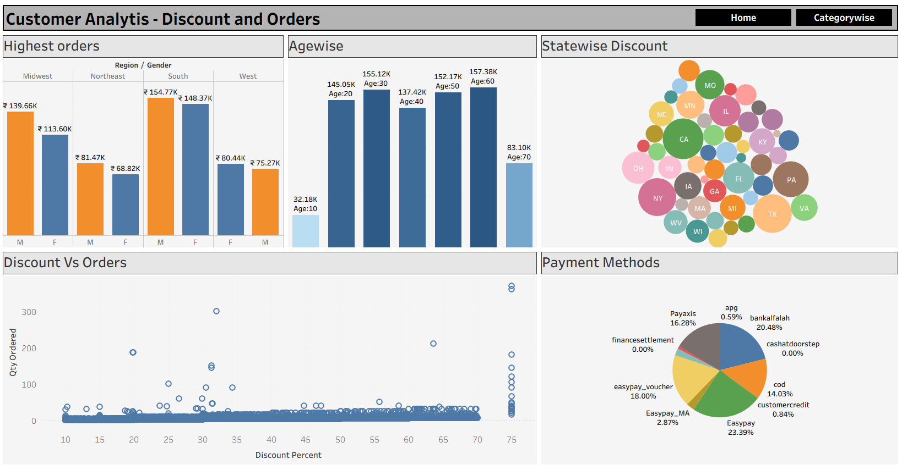
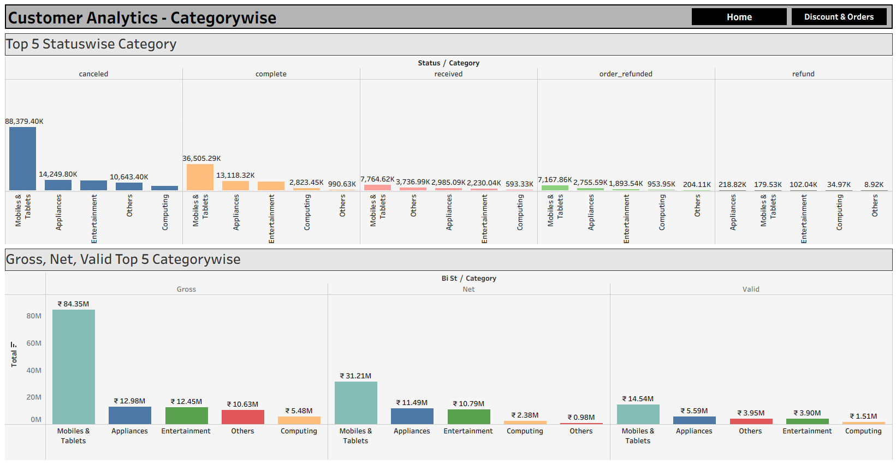

# 📊 Amazon Customer Analytics Dashboard (Tableau)

## 🔹 Overview
This project analyzes **Amazon sales data (FY 2022-23)** using Tableau. 
Note - I have Download from the Kaggle. This is in the Binary Form. Download Orignal From Kaggle.
The dashboards provide insights into **Revenue, Discounts & Orders, and Categorywise Sales**.

---

## 🔹 Dashboard 1: Revenue Analysis

### 🔑 Key Insights:
- **South region** generated the highest revenue (₹89.65M), while **Northeast** had the lowest (₹39.96M).  
- **Mobiles & Tablets (₹140.93M)** dominate category sales, followed by Appliances & Entertainment.  
- **Texas (6.62%) & California (5.94%)** are the top contributing states.  
- **December** recorded the highest monthly revenue (₹57.67M), showing strong seasonal demand.  

---

## 🔹 Dashboard 2: Discount & Orders Analysis

### 🔑 Key Insights:
- **South region (Males: ₹154.77K, Females: ₹148.37K)** placed the highest orders.  
- Customers aged **30–60 years** are the most valuable, contributing over ₹150K in orders.  
- High discounts (above **60%**) generate more orders but reduce profitability.  
- **Easypay (23.39%)** and **Bank Alfalah (20.48%)** are the most preferred payment methods.  

---

## 🔹 Dashboard 3: Categorywise Analysis

### 🔑 Key Insights:
- **Mobiles & Tablets** lead across all order statuses (canceled, completed, received).  
- Gross sales: ₹84.35M, but **Net sales** reduced to ₹31.21M due to cancellations/returns.  
- Appliances and Entertainment are the next best-performing categories after Mobiles & Tablets.  
- Refunds are significantly higher in the **Mobiles & Tablets** category compared to others.  

---

## 🔹 Tools Used
- **Tableau** → Dashboarding & Visualization  
- **Excel** → Data preprocessing & cleaning  

---

## 📌 Key Outcomes
- Identified **top revenue-generating regions, states, and categories**.  
- Showed **impact of discounts** on customer orders & profitability.  
- Segmented customers by **age, gender, and payment methods**.  
- Compared **Gross vs Net vs Valid sales** for better business decisions.  

---

👨‍💻 **Developed by:** Rutikesh Pawar 
🔗 **LinkedIn:** https://www.linkedin.com/in/rutikeshpawar227  
